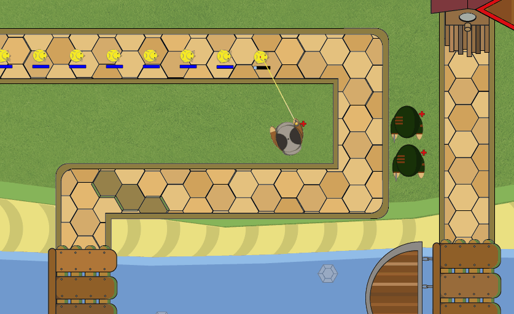

# About
This is the very first videogame from my first year at university. It was developed with other classmates (Victor Ramos, Eloy Villanueva and Pablo Luengo).
It is a tower defense in which you have to build towers to defend yourself from the attack of several species of birds.
The game was made with GameMaker Studio 1.

# Controls

- Press escape to pause the game and display the restart button.
  
- The restart button will lead you back to the menu.

- Press escape again to return to the game.

- Right click to cancel buying a tower.

- The upgrade and sell buttons can be displayed pressing on the red triangle next to the fast forward and next wave buttons.

# Upgrades information

- The cannon does the same attack but gains range and damage as well as increased projectile speed.

- The guy with grey hat gains an additional beam which damages the furthest enemy until it dies.

- The cowboy fires both pistols at once.

- The indian gains poison damage.

- The brown stripped guy throws axes that damage once every enemy they pass through.

- The archer shoots 6 arrows around him.

- The blue guy gains some splash damage and slow.

- The green guy with machete has increased attack speed and damage.

- The fighter gains some splash damage.

- The guy that throws webs throws them continuously.

All of them will attack the nearest enemy until it goes out of range, have this in mind for your strategy.

Have fun!

# Preview

